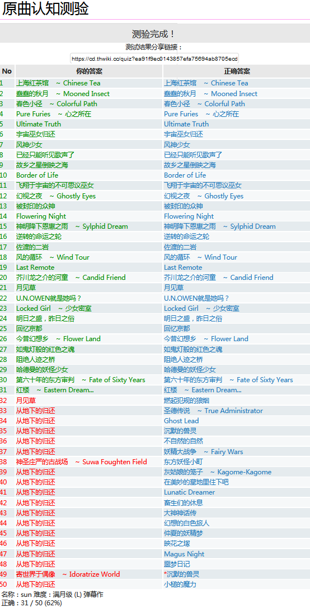

## Introduction

退役 OIer，喜欢在电脑面前发呆。

刷题不多，数学将就，整活还行。总的来说就是不务正业（

常用的语言除了 C++ 就应该是 Python 和 C# 吧。

码风偏工程向，~~经常封装强迫症发作把一车数据结构封到 class 里去结果一点都不好用~~，现在一般用 namespace 封装不需要实例化的数据结构。

特别讨厌可读性低的代码，甚至因此放弃毒瘤卡常题。

整活方面的话，最近在~~填坑~~研究 Minecraft 中基于 Python 和 MIDI 的自动化红石音乐生成，当然还有正在搭的博客啦。~~一放假 github 就一堆小绿点（~~

东方众。熟悉的作品大概从下图能看出来吧

[2021/08/07 原曲认知测验 弹幕作 0.5s 50题](https://cd.thwiki.cc/quiz?ea91f9ec0143857efa75694ab8705ecd)

STG 打的还行，妖妖梦专精，大概 Hard 稳通 Lunatic 混关的水准吧。打过 Extra、Phantasm 的 NMNBNR。目前在懒散的尝试 Lunatic NB。~~差不多咕了~~

远古年代打过 Dancing Line 的全关卡完美。

## Accounts

+ [Github](https://github.com/sun123zxy)
+ [Bilibili](https://space.bilibili.com/70234413)
+ [cnblogs](https://www.cnblogs.com/sun123zxy/)
+ [luogu](https://www.luogu.com.cn/user/23632)

就这些吧。关于博客本身的一些想法，请移步[博客搭建随想](/post/20210817-aboutblog/)。

**Next Phantasm...**